### Network-Analysis
What i studied and did with Network analysis.
In this page, gonna write what i did with network analysis with projects first, and new things that i studied(ex. node2vec, GNN etc..)

# Project (Network analysis with Yonsei Edu-data)

Now i'm in master of Industrial engineering, Yonsei Uni. Really happy to study data science with variational domains and techniques.  
And the most happiest thing is, i can particiapte many projects concerned with data science. This can make me learn many domain issues and related machine learning techiques!
Though we study Machine learning and data scinece really deeply and be clevered, it is useless if we can applied to real-world problems.
So i think projects are really important for upgrading my personal ability to cope with real-world problem (because i dont want to remain in academic area but want to be kinda data analyst,engineer )  
  

In this section - Network analysis, im gonna introduce my first project.
The whole project name is "Research on Development of Education System based on Big Data Analysis".
This project aims to develop a future-oriented convergence education research model that can combine various majors. 
It is a study that utilizes big data in the field to break away from the existing one-sided education methods and come up with measures to realize personal-tailored 
precision education. 
  

Based on the collection and analysis of educational big data, the CTL model can be developed and an artificial intelligence-based diagnostic system can be established. 
To this end, we would like to present an education platform based on artificial intelligence and big data, which is the core of the Fourth Industrial Revolution.
Through research, we hope to secure the ease of personalized education that utilizes educational big data and realize education that maximizes the ability of learners according to their understanding of learning. 
It also expects to realize better education by sharing the results of the big data analysis of education with professors to induce the development of new teaching techniques.
  
  

And my role in here was finding kinda new&hidden educational issue in Uni with Yonsei edu-data.
So i did Network analysis with edu data.
The edu - data : i made this from YONSEI EDUCATIONAL DATABASE, used many interesting tables (Classes taken by several students, class info data, major info data etc...) 
This database is established using 'YSCEC' data, a learning management system that supports online and offline integrated education of Yonsei University. 
The 'YSCEC' data used in this study is intended for the entire 'YSCEC' data for 2016 and 2017.Usage data was generated from approximately 118 million data by database, 426 tables (classes), 1429 Object Properties indicating connectivity between tables, 3426 Data Properties representing column relationships belonging to the table, and about 1 billion RDF-type Triple.
  
  

# Development of a Group Discovery Model using Network Analysis and Connection Relationship and Convergence Studies among Classes
   

### FLow Chart  
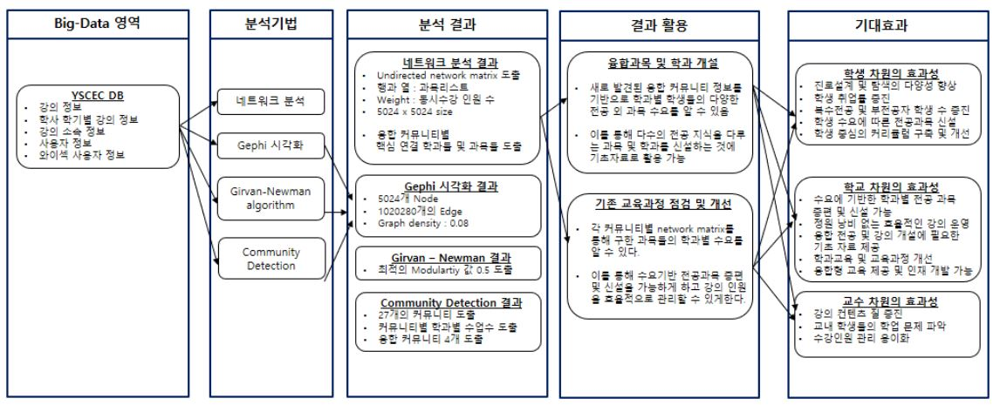 

### Introduction  

Network analysis is a method of quantitatively analyzing the structure or diffusion process of individuals and groups by modelling them into nodes and links. 
This has recently drawn much attention in the fields of social science, including sociology, economics, and business administration, as well as natural sciences such as physics, medicine and biology. 
The increase and accumulation of big data due to the development of Internet services is also increasing opportunities to utilize network data in practice.
There are many things around us that exist in the form of a network, such as Internet networks, road networks, telecommunications networks, and power grids. 
As such, the network has always existed around us and provides the main environment for moving the socio-economic system. 
Therefore, this network analysis can serve as an important methodology for understanding the connections and interrelationships of components in the network structure and increasing the efficiency of the network as a whole.
  

These network-type data were found in this study. 
Usually, this structure could be found in a large frame. 
The first discovery was a network between tables in a self-built DB that organized YSCEC data. 
Through the network between these tables, i was able to see clusters of tables tied together with similar attributes through community detections. 
When I looked at the DB in detail, I could see the categories and clusters by table that I could refer to. 
Following these attempts, I thought that I could cluster data that can be extracted from DB through network analysis. 
[Figure 1] is visualized and tabulated.  

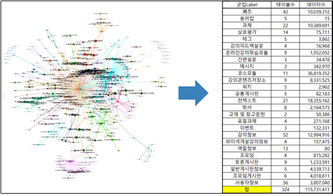 
[Figure 1] Network graph of DB tables (cluster with Community Detection) 
  

I explored the structure of DB to find this data. To explain the structure in detail, in each 'lecture' place, a small number of administrators or a number of behaviors that occur when a participant 'student' interacts with each other were stored in a table. 
Since the YSCEC data itself is stored on the homepage of each lecture, tables (quiz, assignment registration, questions, discussions, etc.) were mainly used to store data for each activity performed within the lecture, and tables were available for information about the lecture and information about the students who took it.
This study explores all lectures and tables that can be applied to students as much as possible. For example, when it comes to tables that store data about 'discussion boards,' there were many lectures that were actively used, but not so. Therefore, the use of the data in this table will result in the exclusion of a large amount of lectures during analysis, which will lose the advantages of big data and lack the entire nature of Yonsei University's education system. Therefore, I explored the subject by looking for tables where more lectures and student data are available. 
Figure 2 shows the Excel sheet used to explore these tables. It went through a process of exploring tables with a large number of data one by one.
  

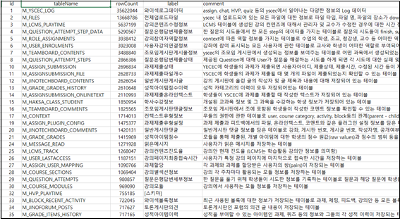 
[Figure 2] Excel sheet with name, number of rows (data), and description of DB tables 
  

The tables that exist in common for all lectures did not really exist. 
Some lectures are enthusiastically used by YSCEC, but others are not even used at all. 
However, the basic information about the lecture and the students taking the course were entered, and the YSCEC for each lecture was opened, so i looked up if there was a table containing the lecture information and student information. 
There existed a lecture information table for almost all lectures and a table with the serial numbers of the students who took the course. 
Using this method, i was able to make a list of courses for each student, and through this, i thought that i could derive the connection relationship between subjects in a network format and analyze various kinds of subjects. 
Based on this, i started to study the subject of 'Connection Relationship Between Classes Using Network Analysis and Development of Convergence Studies and Group Discovery Model'.
  

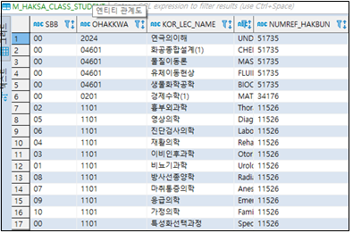 
[Figure 3] M_HAKSA_CLASS_STUDENT Tables - Course names and student serial numbers 
  

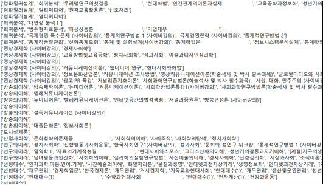 
[Figure 4] txt file that saves list of courses by student in list format 
  

### Experiments  

Using the list of student-specific courses derived from the "M_HAKSA_CLASS_STUDENT" table, the network matrix was derived to calculate the number of common students in each subject, use it as a link weight, and create a network of subjects as nodes. 
This is a matrix of rows and columns of lectures, and for this purpose, the number of concurrent lecture-course classes for each student was calculated using python. 
For example, when a student had a course list of "Modern Society and Psychology," "Cultural Anthropology of the Global Age," "Computer Graphics Design," and "Material Analysis Theory," 
it was calculated that he would be +1 in the line of "Modern Society and Psychology" and "Cultural Anthropology of the Global Village Era." 
In other words, each value is the number of students who took two classes simultaneously during the entire course. 
The total number of classes was about 20,000, so about 20,000 x 20,000 Matrixes were calculated. 
Through this calculated Matrix, i decided to identify the connections and strength of connections between subjects and to use Community Detection among subgrouping methods of prior research.
  

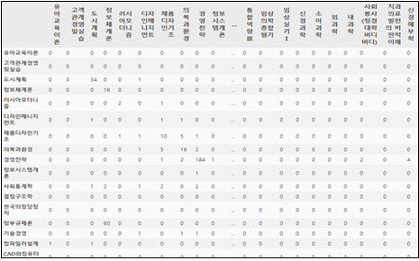 
[Figure 5] part of 20,000 x 20,000 Matrix  
  

However, the disadvantage is that the size of the data is too large at 20,000 x 20,000 matrix, resulting in longer analysis and computing times. 
Therefore, i rewritten Matrix, where only classes that fit the subject of analysis are lined up and worked hard. 
Classes were limited to Sinchon, undergraduate majors and optional liberal arts classes on future campuses, while classes on international campuses, graduate schools, compulsory liberal arts, affiliated foundations and seasonal semesters were excluded. 
Sinchon, the task of summarizing only undergraduate majors and elective liberal arts classes on future campuses was sorted out and sorted out the departments and majors belonging to each class using the M_COURSE_CATEGORY table. A total of 5024 subjects were reconstructed, approximately 1/4 of the nodes and significantly reduced analysis and calculation time.  

Network graphs are generated using Python module NetwrockX and Gephi, a visualization and analysis tool. I used NetwrockX to create additional graph weighting and gxef file, and i used it to do various visualizations and analyses using Gephi.
Community Detection was performed with one analysis. Detection was performed through the adjustment of the Resolution coefficient. The Resolution coefficient was 0.3,0.5,0.7,1 and so on, and the Modularity values added from each were compared. 
When the Resolution coefficient was 0.5, the Modularity value was the largest with 0.573, and this Resolution coefficient was used to determine the optimal network graph.
  

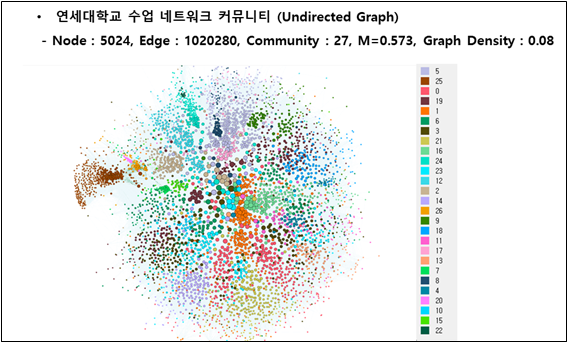 
[Figure 6] Network comminities of Yonsei Uni  
  

The above picture is 'Yonsei Uni's Class Network Community Graph'. 
Nodes bound together in the same community were marked in the same color. The number of communities is 27 and the graph density is 0.08. 
I used this network and started in-dept analysis
  

First, I checked the assigned class list for each community. It was necessary to see what the classes assigned to each community were and what the commonalities were. 
Since it is difficult to identify commonalities only by the names of classes, the department of belonging to the classes was further labeled. 
This work also used the M_COURSE_CATEGORY table to find out which departments belonged to each class.
  

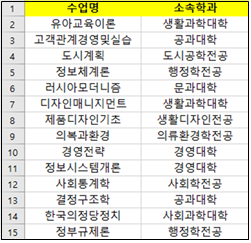 
[Figure 7] Example of Labeling with the Department of Course  
  

After labelling departments in each class, detailed analyses were now conducted for each community. 
By checking the number of departments in each community, i explored what is common in the community.   

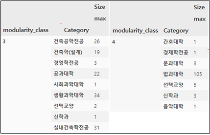 
[Figure 8] Examples of departments and numbers belonging to each community 
  

After checking the number of departments under the table, the results of the three-part class were derived in histogram. 
What is certain about each community is that it was named after specific departments and colleges, and the newly determined community of unfamiliar combinations of departments was named "convergence".  

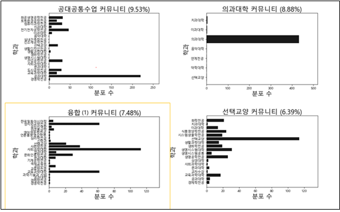 
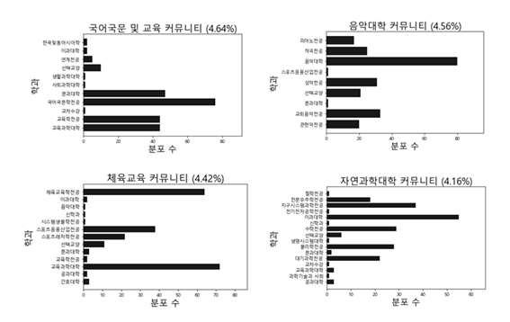 
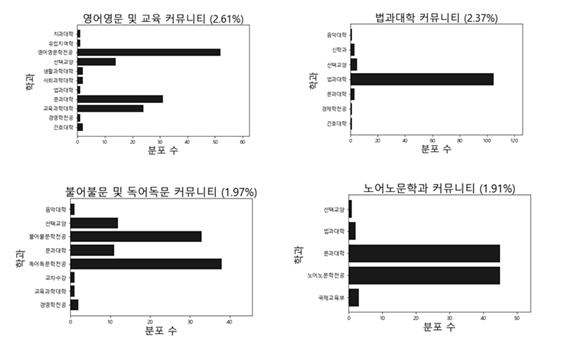 
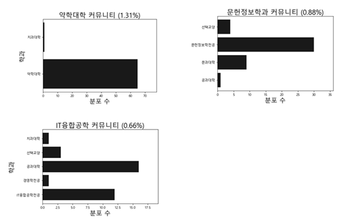 
[Figure 9] Histogram of the results of the in-depth analysis by community.  

### Results  

A total of four convergence communities were determined and the convergence (2) communities were analyzed in detail.  

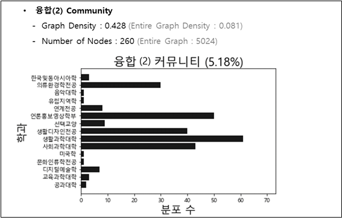 
[Figure 10] Convergence(2) Community information  
  

The convergence2 community had 260 nodes, or 518% of the 5,024 nodes. Among them, clothing, environmental studies, media promotion and video studies, and daily design majors accounted for most of them. 
Nodes marked as College of Living Science and College of Social Sciences were also all three departments after class inquiry. 
In what way did these three departments become integrated? Based on the Department of Media Promotion and Film Studies (Sociological Science College), the two remaining majors were compared. 
I drew out how classes in each department were connected and which classes were most connected. 
This was done after the reconstruction of rows and columns consisting only of the classes in the Cabinet from the initially derived network matrix.
  

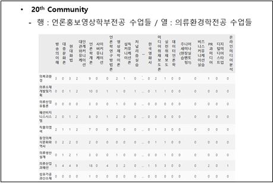 
[Figure 11] Connectivity between the Department of Media Promotion and Film and the Department of Clothing and Environmental Studies  
  

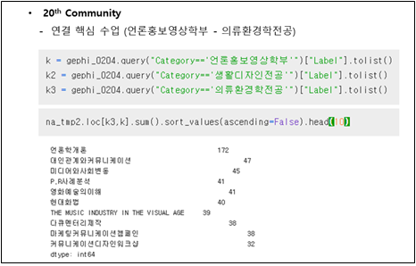 
[Figure 12] Classes with a high connection between the Department of Media Promotion and Film and the Department of Clothing and Environmental Studies. 
  

Ten classes with the highest degree of connection between the Department of Media Promotion and Film and the Department of Clothing and Environmental Studies have been selected. 
There is a media introduction, interpersonal relations and communication. 

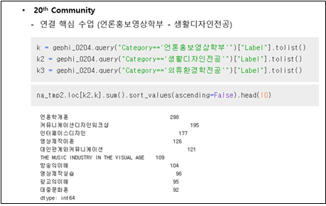 
[Figure 13] Classes with a high connection between the Department of Media Promotion and Visualization and the major of Life Design.  
  

I have selected 10 classes with the highest degree of connection among the linked classes in the Department of Media Promotion and Film and the Department of Life Design. 
There is an unpublished introduction, communication design workshop, etc.
In fact, as a result of consulting with a professor of journalism and video, he said that students in the department of media promotion and video studies take classes in daily design to take computer classes related to video production or design, which are not open on confectionery. 
In comparison to this advice, it can be seen that the need for a convergence of two departments exists in students. Through this result, it is possible to propose the opening of a convergence department or a convergence class group.
For future analysis, i will try to find convergent needs by removing the connection diagram between oligarchs, creating an ego-network for each unit, and then trying several more.

                
